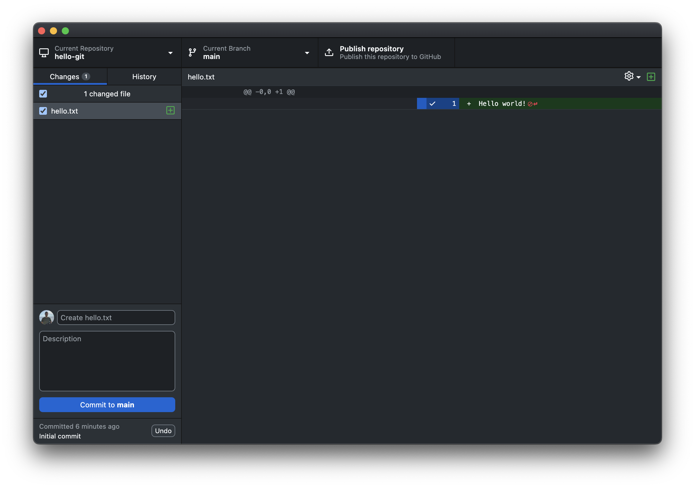
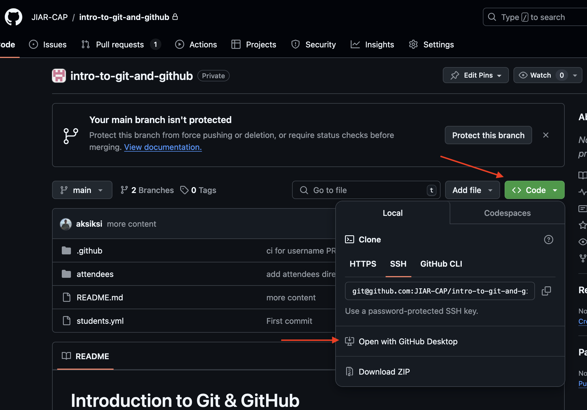

# Introduction to Git & GitHub

Playground repo: https://github.com/JIAR-CAP/intro-to-git-and-github-playground

## Outline

1. What is Git? Brief history, motivation
2. What is a Git repo?
3. Create a new repo
4. Basic Git operations using GitHub Desktop
5. Push your changes to GitHub
6. More commands
7. Branching
8. Fork playground repo
9. Create a pull request (PR) from a local branch
10. Fork main repo
11. Open an issue in main repo
12. Create a pull request from your fork

## First-Time Setup

### (1) Create a GitHub account

Create a GitHub account: https://github.com/join/

### (2) Install GitHub Desktop

https://desktop.github.com/download/

### (3) Install Git

#### Windows

Download & install Git: https://git-scm.com/download/win

#### macOS

1. Install Homebrew: https://brew.sh/

Open Terminal and paste the command on that page, then hit Enter.

2. Install Git:

```
brew install git
```

#### Linux

Run one of these commands based on your Linux distro: https://git-scm.com/download/linux

## What is Git?

Reference: https://git-scm.com/book/en/v2/Getting-Started-What-is-Git%3F

Cheatsheet: https://ndpsoftware.com/git-cheatsheet.html#loc=index

## What is a Git repository (repo)?

TODO.

## Create your first repo

Open GitHub Desktop and click on "Create a New Repository on Local Drive":


Fill in the following information:

* Repository name: `hello-git`
* Description: `My first Git repo.`
* Keep everything else as-is.

### Navigating the GitHub Desktop UI

The UI shows you some important info (starting from top left):

* Name of the current repo (you can switch between them)
* Name of the current *branch* (`main`)
    * We'll get into what a branch is later.
* Publish to GitHub button
* On the left pane: current changes
* Bottom left: create a *commit*
* Middle: open this repo in your editor

## Basic Git operations using UI

### Create a new file

Let's create a file at the root called `hello.txt` with the following content:

```
Hello world!
```

Save this file and switch back to GitHub Desktop. You should see that `hello.txt` has been created:



### Commit your changes

Write a short commit message and click "Commit". Check history to confirm.

### Make some changes to file

```
Hello world!

This is another line.
```

Then commit!

## GitHub

Clone the playground repo: https://github.com/JIAR-CAP/intro-to-git-and-github-playground



### Push changes to GitHub

Click button in UI to push your changes.

### Pull changes from GitHub

Make a change to the README on GitHub, then commit via UI.

Navigate to GHD and click "Fetch origin".

### Create a Pull Request (PR): Add your username to the repo

Create a new branch in the GHD UI called `add-username`.

Add your username in two places:

1. New file under the `add-your-username-file` folder named `<username>.txt`
2. New entry in `add-your-username.yml`

Commit & push to GitHub. Visit GitHub UI to create a new pull request (PR).

### Create a Pull Request (PR): Implement the multiply CLI in Python

Task: implement a `multiply` CLI subcommand and add a new test for it.

Create a new branch in GHD UI called `implement-multiply`.

Commit your change(s) to the branch, then push the branch to GitHub and open a PR.

### Create a Pull Request (PR) from a fork

Repo: https://github.com/JIAR-CAP/intro-to-git-and-github

1. Open an issue to add a new file under `attendees`.
2. Fork the main repo: https://github.com/JIAR-CAP/intro-to-git-and-github
    * Click
3. Open a PR to add your name & close the issue you created.
    * Filename should match your username, otherwise CI checks will fail :)

### Future Topics

GH Actions, GH Pages, ???

## Resources

### Videos

* Git & GH Desktop tutorial: https://www.youtube.com/watch?v=8Dd7KRpKeaE

### Text

* Git book: https://git-scm.com/book/en/v2
* Git cheatsheet: https://ndpsoftware.com/git-cheatsheet.html#loc=index;
* Git in VS Code: https://code.visualstudio.com/docs/sourcecontrol/intro-to-git
* GitHub cheatsheet: https://training.github.com/downloads/github-git-cheat-sheet.pdf 

## Appendix

### Git CLI

### Create your first repo

```
mkdir -p ~/repos/hello-git

cd ~/repos/hello-git

git init .
```

### Basic CLI commands

* `git status`
* `git diff`
* `git add`
* `git restore [--staged]`
* `git commit -m`
* `git push`
* `git commit --amend`

### `.gitignore`

Use this to ignore files you don't want to track.

### Branching and merging

Create a new local branch:

```
git checkout -b my-new-branch
```

Make changes and commit:

```
git add .
git commit -m "commit on the new branch"
```

Switch back to the main branch:

```
git checkout main
```

Merge changes on branch back to main:

```
git merge my-new-branch
```

### Stashing Changes

Stash away changes temporarily (acts as a stack):

```
git stash
```

Restore the stashed changes:

```
git stash apply
```

### Advanced CLI commands

* `git grep`: Grep, but ignores `.git/` and `.gitignore` matches
* `git diff HEAD~1`: diff HEAD against previous commit (adjust number as needed)
* **[x]** `git add -p`: add patches, allows staging only parts of your changes
* `git commit -p`: same as above, but also commit
* **[x]** `git rebase -i`: interactive rebase, reorder/merge/drop **local** commits
* **[x]** `git tag`: tagging commits (i.e., releases)
* `git show`: like `status` but shows latest commit message and content

## GitHub via Terminal

### Prerequisite: Setup SSH

This simplifies connecting to GitHub.

1. Generate a new SSH key on your machine (choose platform): https://docs.github.com/en/authentication/connecting-to-github-with-ssh/generating-a-new-ssh-key-and-adding-it-to-the-ssh-agent
2. Add the SSH key to your account: https://docs.github.com/en/authentication/connecting-to-github-with-ssh/adding-a-new-ssh-key-to-your-github-account

Clone the [playground repo](https://github.com/JIAR-CAP/intro-to-git-and-github-playground):

```
cd ~/repos/
git clone git@github.com:JIAR-CAP/intro-to-git-and-github-playground.git
cd intro-to-git-and-github-playground
```

### Push to GitHub

Commit a change, then:

```
git push
```

This will push the change up to the remote repo on GitHub. Verify by opening the repo page.

### Pull from GitHub

Make a change to the README on GitHub, then commit via UI. Go to your local repo:

```
git pull
```

Verify that you see the README commit locally.

### Create a Pull Request (PR): Add your username to the repo

Create a new branch locally:

```
git checkout -b add-my-username
```

### Create a Pull Request (PR): Implement the multiply CLI in Python

Task: implement a `multiply` CLI subcommand and add a test for it.

Create a new branch:

```
git checkout -b multiply
```

Commit your change(s) to the branch, then push the branch to GitHub.

You can now open a PR and merge it. Explain: merge vs. squash.

